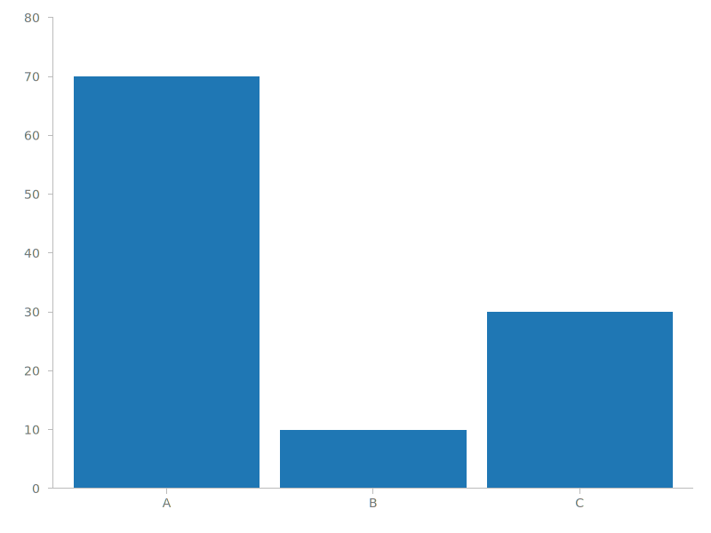
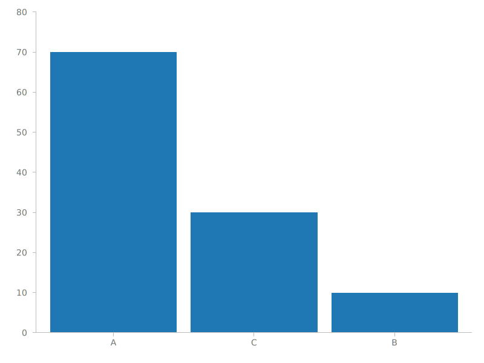
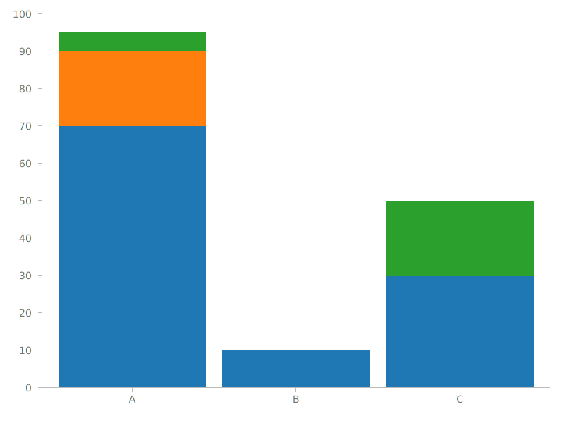
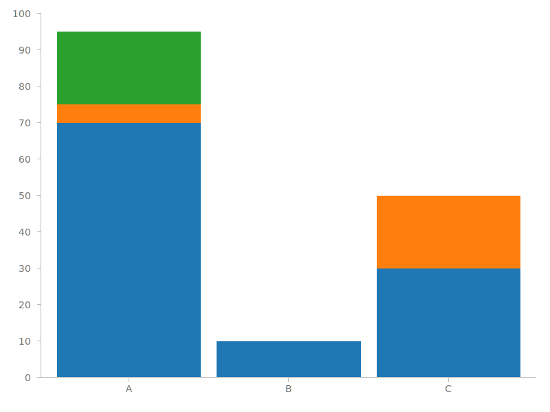

# rustplotlib

A pure Rust visualization library inspired by D3.js.

## Install

You can add this as a dependency to your project in your `Cargo.toml` file:

```toml
[dependencies]
rustplotlib = "0.1.0"
```

## Chart Types

The library supports the following charts (more to be added soon):

1. Vertical Bar Chart
2. Vertical Stacked Bar Chart
3. Horizontal Bar Chart (TBD next)
4. Horizontal Stacked Bar Chart (TBD next)
5. Scatter Chart (TDB)
6. Line Chart (TBD)

## Philosophy

There are myriads of visualization libraries in the World Wide Web for any programming language,
but there are very few of them for Rust.

Inspired by D3.js and constrained by the Rust way of doing things, this library revolves around
*Dataset Representations* that can be combined in different ways and displayed on a chart.

In order to know how to interpolate input data to output chart entries, there is a concept of a
*scale* that has to be defined when creating a chart (see examples below).

## Examples

Below you can find examples of charts that are currently supported.

### Vertical Bar Chart

Here is the sample code:

```rust
use rustplotlib::{Chart, VerticalBarDataset, ScaleBand, ScaleLinear};
use rustplotlib::utils::Range;

fn main() {
    // Create a band scale to map categories on X axis.
    // The range of 0 - 720 defines the available width of the chart.
    // By default, a chart is 800px wide with 60px margin on the left and 20px on the right.
    let x = ScaleBand::new()
        .set_domain(vec![String::from("A"), String::from("B"), String::from("C")]) // domain based on input data
        .set_range(Range::new(0_f32, 720_f32)) // the range onto which to map the domain
        .set_inner_padding(0.1) // defines space between bars. default is 0.1, can be omitted
        .set_outer_padding(0.1); // defines space at the margins of chart. default is 0.1, can be omitted
    
    // Create a linear scale to map bar heights on Y axis.
    // By default, the chart is 600px tall with 20px margin at the top and 50px at the bottom.
    let y = ScaleLinear::new()
        .set_domain(vec![0_f32, 80_f32])
        .set_range(Range::new(0_f32, 530_f32));

    // You can use your own iterable as data as long
    // as its items implement the `BarDatum` trait.
    let data = vec![("A", 70), ("B", 10), ("C", 30)];

    // Represent the data as a vertical bars dataset.
    let dataset = VerticalBarDataset::new()
        .set_x_scale(&x)
        .set_y_scale(&y)
        .load_data(&data).unwrap();

    // Create the chart and add the dataset and axes to the left and bottom of chart.
    Chart::new()
        .add_dataset(&dataset)
        .add_axis_bottom(&x)
        .add_axis_left(&y)
        .save("vert-bar-chart.svg").unwrap();
}
```

Here is the result:



The display order of categories is defined by the vector passed to `set_domain()` of a `ScaleBand`.
If you'll switch that order to `"A", "C", "B"`, the result will change as follows.



You can play with `set_inner_padding()` and `set_outer_padding()` values to customize the appearance of the chart.

### Vertical Stacked Bar Chart

A simple bar chart (as the one above) is a specific instance of a stacked bar chart where there
is only one type of values. Under the hood, `rustplotlib` treats both types pretty much the same,
that's why the code is almost identical, except the input data must provide a `key` by which to group
and stack values.

```rust
use rustplotlib::{Chart, VerticalBarDataset, ScaleBand, ScaleLinear};
use rustplotlib::utils::Range;

fn main() {
    // Create a band scale to map categories on X axis.
    // The range of 0 - 720 defines the available width of the chart.
    // By default, a chart is 800px wide with 60px margin on the left and 20px on the right.
    let x = ScaleBand::new()
        .set_domain(vec![String::from("A"), String::from("B"), String::from("C")])
        .set_range(Range::new(0_f32, 720_f32))
        .set_inner_padding(0.1);

    // Create a linear scale to map bar heights on Y axis.
    // By default, the chart is 600px tall with 20px margin at the top and 50px at the bottom.
    let y = ScaleLinear::new()
        .set_domain(vec![0_f32, 100_f32])
        .set_range(Range::new(0_f32, 530_f32));

    // You can use your own iterable as data as long
    // as its items implement the `BarDatum` trait.
    let data = vec![("A", 70, "foo"), ("B", 10, "foo"), ("C", 30, "foo"), ("A", 20, "bar"), ("A", 5, "baz"), ("C", 20, "baz")];

    // Represent the data as a vertical bars dataset.
    let dataset = VerticalBarDataset::new()
        .set_x_scale(&x)
        .set_y_scale(&y)
        .load_data(&data).unwrap();

    // Create the chart and add the dataset and axes to the left and bottom of chart.
    Chart::new()
        .add_dataset(&dataset)
        .add_axis_bottom(&x)
        .add_axis_left(&y)
        .save("vert-stacked-bar-chart.svg").unwrap();
}
```

The result:



By default, the order of the keys in the input data dictates the stacking order. You can, however,
adjust that by specifying a different order using the `set_keys()` method on the `VerticalBarDataset` 
struct before calling `load_data()`:

```rust
// Represent the data as a vertical bars dataset.
let dataset = VerticalBarDataset::new()
    .set_x_scale(&x)
    .set_y_scale(&y)
    .set_keys(vec![String::from("foo"), String::from("baz"), String::from("bar")])
    .load_data(&data).unwrap();
```

The result of that is as follows (notice the order in the first bar has changed):


