# charts

A pure Rust visualization library inspired by D3.js.

See [gallery](./gallery) and [examples](./examples) for code and more charts.

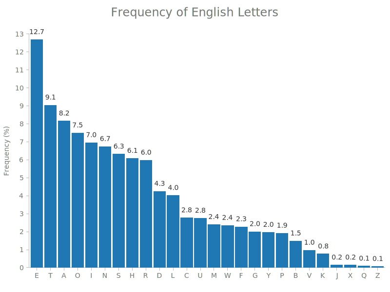

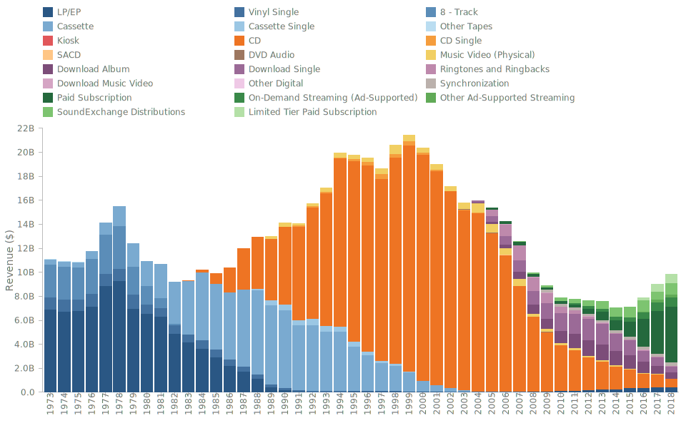

## Install

You can add this as a dependency to your project in your `Cargo.toml` file:

```toml
[dependencies]
charts = "0.3.0"
```

## Chart Types

The library supports the following charts (more to be added soon):

1. Vertical Bar Chart
2. Vertical Stacked Bar Chart
3. Horizontal Bar Chart
4. Horizontal Stacked Bar Chart
5. Scatter Chart
6. Line Chart
7. Area Chart
7. Histogram (TBD)
8. Box Plot (TBD)
9. Other (TBD)

Also, **composite charts** are supported (see Composite Charts below)

## Building Blocks

Here are the components that allow you to create a chart:

1. **Scales**
2. **Views**
3. Axes
4. Size and Margins
5. Legend
 
The first two are foundational components that offer a certain degree of flexibility in how data is
represented and how it can be combined to achieve the desired outcome when the goal is to visualize
data beyond simple forms.

Let's dive into each building block and define its structure and API, or you can go to Examples section
and see what you can build using `charts`.

### 1. Scales

A scale is an entity that transforms data from one dimension into another. The dimension you are transforming
from is called **domain** and the dimension you are transforming to is called **range**.
Currently, `charts` has implemented two types of scales:

1. Linear Scale
2. Band Scale

#### Linear Scale

A linear scale is an interpolation function that takes in a domain (e.g. [0, 10]) and a range (e.g.
[0, 50]) and is able to transform a value from the domain into a corresponding value in the range
(e.g. 5 -> 25).

When using a linear scale to create a chart, the **domain** represents the range of values that are
present in the dataset. For instance, if you have a simple dataset `vec![123, 48, 232, 99]`, the
domain is represented by `[48, 232]` (but it can also be represented by `[40, 240]` or `[0, 1000]`,
more on that in a minute).

Conversely, the **range** of a scale represents the diapason that is available for rendering.
For instance, if you have a chart that is 800px wide and 50px margin on the left and 50px margin
on the right (see Margins below), this means that the available range to render data is `[0, 700]`.

Thus, if to combine the **domain** and the **range** concepts, a scale with `domain[0, 10]` and a
`range[0, 500]` will map all points from 0 to 10 onto a range of 0 to 500 pixels.

#### Band Scale

A band scale takes in a list of distinct **domain** values (e.g. categories, years) and a continuous
**range** and interpolates the domain onto the range. It is often used in Bar Charts, where you need
to map a categorical dataset onto a continuous axis of a specific size.

For instance, a band scale with `domain["Apples", "Oranges", "Pears"]` and a `range[0, 100]` will
map the `"Apples"` domain to `0`, `"Oranges"` to `33.33` and `"Pears"` to `66.66`. The actual 
implementation has an `inner_padding` value that will leave a gap between the categories, so the real
mapped values are going to be a bit different.

### 2. Views

Since the same dataset can be represented in different forms, there is a concept of a **View**
that denotes a specific representation of the data.

Since a view of the data is a representation of that data along 2 dimensions (in 2D charts), each view
requires a scale for its X dimension and a scale for its Y dimension.

Here is the list of views that are available:

1. VerticalBarView
2. HorizontalBarView
3. ScatterView
4. LineSeriesView
5. AreaSeriesView

### 3. Axes

An axis is a representation of the range of the domain that is being visualized. This means that
in order to properly display an axis, it should operate with the same scale as a view does.

As a user, you will not explicitly create axes, but rather where to draw the axis (top, right, bottom,
left) and what scale to use for that axis.

### 4. Size and Margins

When creating a chart, you can customize its layout to some degree.

You can set chart width and height as well as the margins (top, right, bottom, left). Chart margins
are the padding from the chart borders that define how much space will be left for axes and other
elements that are not related to a view of the data.

For instance, a chart with 800px wide and 600px tall and margins of `top: 100, right: 40, bottom: 50,
left: 60` will leave an area of 700px wide and 450px tall for actual data representation.

```
      width - 800
+-------------------------------------------------------+
|                        top                            |  h
|                        100                            |  e
|     +-------------------------------------------+     |  i
|     |                                           |     |  g
|left |                  Actual                   |right|  h
| 60  |                   Data                    | 40  |  t
|     |                   View                    |     |  
|     |                700 x 450                  |     |  6
|     |                                           |     |  0
|     |                                           |     |  0
|     +-------------------------------------------+     |
|                      bottom - 50                      |
+-------------------------------------------------------+
```

### 5. Legend

The legend is automatically populated with entries present in each view
attached to a chart. In order to add a legend to a chart, use the
`add_legend_at(position: AxisPosition)` method on a chart instance (don't
forget to leave sufficient margin at the bottom for the legend to show up).

The dataset's `key` values are used as legend entry labels. In case the
dataset doesn't have any key values (i.e. when the dataset represents a
single type of data), you can specify a custom label on a `View` via the
`.set_custom_data_label(label: String)` method. Check out the 
[Chart Composition](#chart-composition) section example of scatter plot
with two datasets.

## Examples

Below you can find examples of charts that are currently supported.

### Vertical Bar Chart

Here is the sample code:

```rust
use charts::{Chart, VerticalBarView, ScaleBand, ScaleLinear};

fn main() {
    // Define chart related sizes.
    let width = 800;
    let height = 600;
    let (top, right, bottom, left) = (90, 40, 50, 60);

    // Create a band scale that maps ["A", "B", "C"] categories to values in the [0, availableWidth]
    // range (the width of the chart without the margins).
    let x = ScaleBand::new()
        .set_domain(vec![String::from("A"), String::from("B"), String::from("C")])
        .set_range(vec![0, width - left - right])
        .set_inner_padding(0.1)
        .set_outer_padding(0.1);

    // Create a linear scale that will interpolate values in [0, 100] range to corresponding
    // values in [availableHeight, 0] range (the height of the chart without the margins).
    // The [availableHeight, 0] range is inverted because SVGs coordinate system's origin is
    // in top left corner, while chart's origin is in bottom left corner, hence we need to invert
    // the range on Y axis for the chart to display as though its origin is at bottom left.
    let y = ScaleLinear::new()
        .set_domain(vec![0, 100])
        .set_range(vec![height - top - bottom, 0]);

    // You can use your own iterable as data as long as its items implement the `BarDatum` trait.
    let data = vec![("A", 90), ("B", 10), ("C", 30)];

    // Create VerticalBar view that is going to represent the data as vertical bars.
    let view = VerticalBarView::new()
        .set_x_scale(&x)
        .set_y_scale(&y)
        .load_data(&data).unwrap();

    // Generate and save the chart.
    Chart::new()
        .set_width(width)
        .set_height(height)
        .set_margins(top, right, bottom, left)
        .add_title(String::from("Bar Chart"))
        .add_view(&view)
        .add_axis_bottom(&x)
        .add_axis_left(&y)
        .add_left_axis_label("Units of Measurement")
        .add_bottom_axis_label("Categories")
        .save("vertical-bar-chart.svg").unwrap();
}
```

Here is the result:


The display order of categories is defined by the vector passed to `set_domain()` of a `ScaleBand`.
If you'll switch that order to `"A", "C", "B"`, the resulting order will adjust as well.

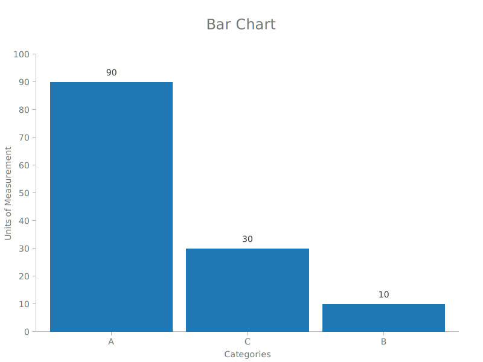

You can play with `set_inner_padding()` and `set_outer_padding()` values to customize the appearance of the chart.

### Vertical Stacked Bar Chart

A simple bar chart (as the one above) is a specific instance of a stacked bar chart where there
is only one type of values. Under the hood, `charts` treats both types pretty much the same,
that's why the code is almost identical, except the input data must provide a `key` by which to group
and stack values.

```rust
use charts::{Chart, VerticalBarView, ScaleBand, ScaleLinear, BarLabelPosition};

fn main() {
    // Define chart related sizes.
    let width = 800;
    let height = 600;
    let (top, right, bottom, left) = (90, 40, 50, 60);

    // Create a band scale that maps ["A", "B", "C"] categories to values in [0, availableWidth]
    // range (the width of the chart without the margins).
    let x = ScaleBand::new()
        .set_domain(vec![String::from("A"), String::from("B"), String::from("C")])
        .set_range(vec![0, width - left - right]);

    // Create a linear scale that will interpolate values in [0, 100] range to corresponding
    // values in [availableHeight, 0] range (the height of the chart without the margins).
    // The [availableHeight, 0] range is inverted because SVGs coordinate system's origin is
    // in the top left corner, while chart's origin is in bottom left corner, hence we need to
    // invert the range on Y axis for the chart to display as though its origin is at bottom left.
    let y = ScaleLinear::new()
        .set_domain(vec![0, 100])
        .set_range(vec![height - top - bottom, 0]);

    // You can use your own iterable as data as long as its items implement the `BarDatum` trait.
    let data = vec![("A", 70, "foo"), ("B", 10, "foo"), ("C", 30, "foo"), ("A", 20, "bar"), ("A", 5, "baz")];

    // Create VerticalBar view that is going to represent the data as vertical bars.
    let view = VerticalBarView::new()
        .set_x_scale(&x)
        .set_y_scale(&y)
        // .set_label_visibility(false)  // <-- uncomment this line to hide bar value labels
        .set_label_position(BarLabelPosition::Center)
        .load_data(&data).unwrap();

    // Generate and save the chart.
    Chart::new()
        .set_width(width)
        .set_height(height)
        .set_margins(top, right, bottom, left)
        .add_title(String::from("Stacked Bar Chart"))
        .add_view(&view)
        .add_axis_bottom(&x)
        .add_axis_left(&y)
        .add_left_axis_label("Units of Measurement")
        .add_bottom_axis_label("Categories")
        .save("stacked-vertical-bar-chart.svg").unwrap();
}
```

The result:

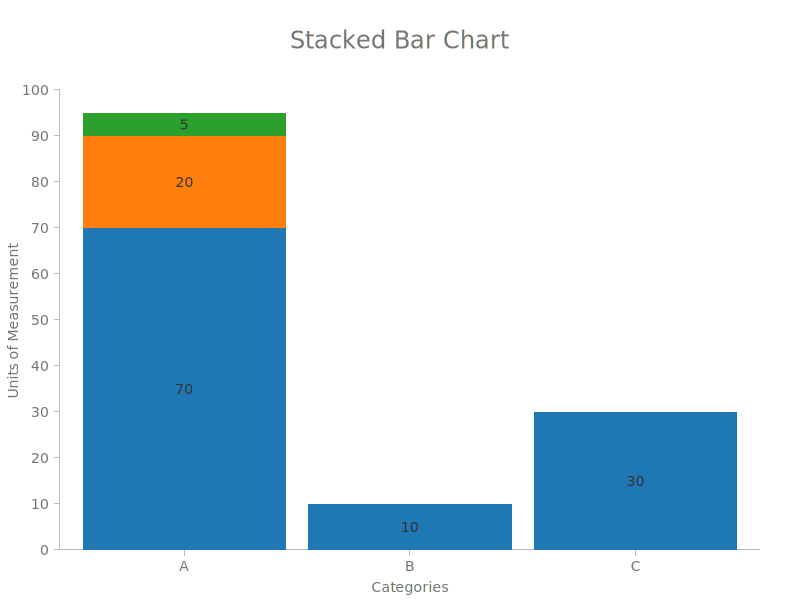

By default, the order of the keys in the input data dictates the stacking order. You can, however,
adjust that by specifying a different order using the `set_keys()` method on the `VerticalBarDataset` 
struct before calling `load_data()`:

```rust
// Create VerticalBar view that is going to represent the data as vertical bars.
let view = VerticalBarView::new()
    .set_x_scale(&x)
    .set_y_scale(&y)
    .set_keys(vec![String::from("foo"), String::from("baz"), String::from("bar")])
    // .set_label_visibility(false)  // <-- uncomment this line to hide bar value labels
    .set_label_position(BarLabelPosition::Center)
    .load_data(&data).unwrap();
```

The result of that is as follows (notice the order in the first bar has changed):

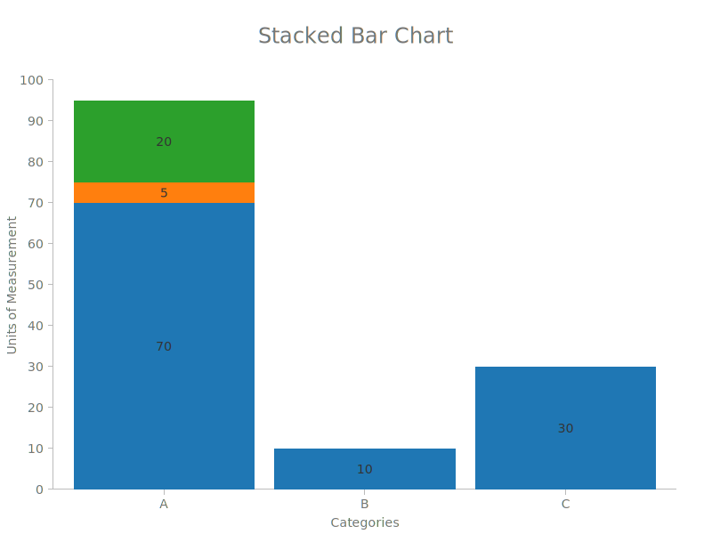


### Scatter Plot

```rust
use charts::{Chart, ScaleLinear, ScatterView, MarkerType, PointLabelPosition};

fn main() {
    // Define chart related sizes.
    let width = 800;
    let height = 600;
    let (top, right, bottom, left) = (90, 40, 50, 60);

    // Create a band scale that will interpolate values in [0, 200] to values in the
    // [0, availableWidth] range (the width of the chart without the margins).
    let x = ScaleLinear::new()
        .set_domain(vec![0, 200])
        .set_range(vec![0, width - left - right]);

    // Create a linear scale that will interpolate values in [0, 100] range to corresponding
    // values in [availableHeight, 0] range (the height of the chart without the margins).
    // The [availableHeight, 0] range is inverted because SVGs coordinate system's origin is
    // in top left corner, while chart's origin is in bottom left corner, hence we need to invert
    // the range on Y axis for the chart to display as though its origin is at bottom left.
    let y = ScaleLinear::new()
        .set_domain(vec![0, 100])
        .set_range(vec![height - top - bottom, 0]);

    // You can use your own iterable as data as long as its items implement the `PointDatum` trait.
    let scatter_data = vec![(120, 90), (12, 54), (100, 40), (180, 10)];

    // Create Scatter view that is going to represent the data as points.
    let scatter_view = ScatterView::new()
        .set_x_scale(&x)
        .set_y_scale(&y)
        .set_label_position(PointLabelPosition::E)
        .set_marker_type(MarkerType::Square)
        .load_data(&scatter_data).unwrap();

    // Generate and save the chart.
    Chart::new()
        .set_width(width)
        .set_height(height)
        .set_margins(top, right, bottom, left)
        .add_title(String::from("Scatter Chart"))
        .add_view(&scatter_view)
        .add_axis_bottom(&x)
        .add_axis_left(&y)
        .add_left_axis_label("Custom X Axis Label")
        .add_bottom_axis_label("Custom Y Axis Label")
        .save("scatter-chart.svg").unwrap();
}
```

The result:

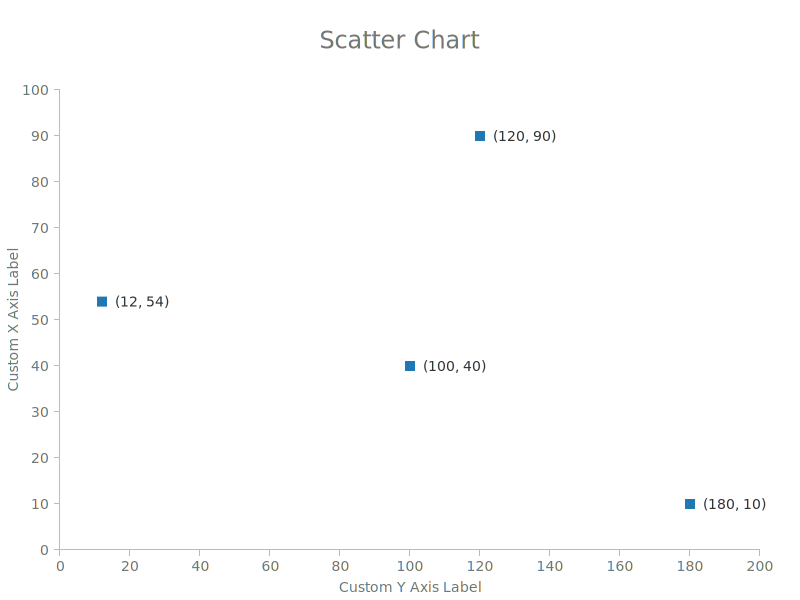

You can customize the appearance and layout as follows:

Choose how labels should display relative to the mark. Available options: _N, NE, E, SE, S, SW, W, NW_

Choose the mark type for the points. Available options: _Square, Circle, X_

If the dataset has a `key` which differentiates the points you can also use a `ScatterView` to display
it.

```rust
use charts::{Chart, ScaleLinear, ScatterView, MarkerType, Color, PointLabelPosition};

fn main() {
    // Define chart related sizes.
    let width = 800;
    let height = 600;
    let (top, right, bottom, left) = (90, 40, 50, 60);

    // Create a band scale that will interpolate values in [0, 200] to values in the
    // [0, availableWidth] range (the width of the chart without the margins).
    let x = ScaleLinear::new()
        .set_domain(vec![0, 200])
        .set_range(vec![0, width - left - right]);

    // Create a linear scale that will interpolate values in [0, 100] range to corresponding
    // values in [availableHeight, 0] range (the height of the chart without the margins).
    // The [availableHeight, 0] range is inverted because SVGs coordinate system's origin is
    // in top left corner, while chart's origin is in bottom left corner, hence we need to invert
    // the range on Y axis for the chart to display as though its origin is at bottom left.
    let y = ScaleLinear::new()
        .set_domain(vec![0, 100])
        .set_range(vec![height - top - bottom, 0]);

    // You can use your own iterable as data as long as its items implement the `PointDatum` trait.
    let scatter_data = vec![(120, 90, "foo"), (12, 54, "foo"), (100, 40, "bar"), (180, 10, "baz")];

    // Create Scatter view that is going to represent the data as points.
    let scatter_view = ScatterView::new()
        .set_x_scale(&x)
        .set_y_scale(&y)
        .set_label_position(PointLabelPosition::E)
        .set_marker_type(MarkerType::Circle)
        .set_colors(Color::color_scheme_dark())
        .load_data(&scatter_data).unwrap();

    // Generate and save the chart.
    Chart::new()
        .set_width(width)
        .set_height(height)
        .set_margins(top, right, bottom, left)
        .add_title(String::from("Scatter Chart"))
        .add_view(&scatter_view)
        .add_axis_bottom(&x)
        .add_axis_left(&y)
        .add_left_axis_label("Custom X Axis Label")
        .add_bottom_axis_label("Custom Y Axis Label")
        .save("scatter-chart-multiple-keys.svg").unwrap();
}
```

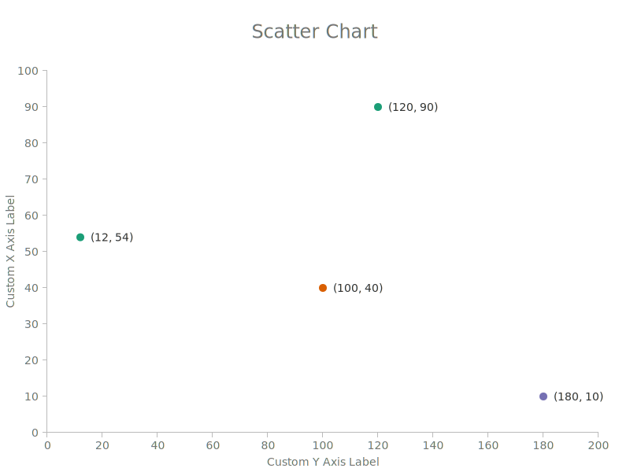

### Line Series

Line series supports the same functionality os a Scatter plot.

```rust
use charts::{Chart, ScaleLinear, MarkerType, PointLabelPosition, LineSeriesView};

fn main() {
    // Define chart related sizes.
    let width = 800;
    let height = 600;
    let (top, right, bottom, left) = (90, 40, 50, 60);

    // Create a band scale that will interpolate values in [0, 200] to values in the
    // [0, availableWidth] range (the width of the chart without the margins).
    let x = ScaleLinear::new()
        .set_domain(vec![0_f32, 200_f32])
        .set_range(vec![0, width - left - right]);

    // Create a linear scale that will interpolate values in [0, 100] range to corresponding
    // values in [availableHeight, 0] range (the height of the chart without the margins).
    // The [availableHeight, 0] range is inverted because SVGs coordinate system's origin is
    // in top left corner, while chart's origin is in bottom left corner, hence we need to invert
    // the range on Y axis for the chart to display as though its origin is at bottom left.
    let y = ScaleLinear::new()
        .set_domain(vec![0_f32, 100_f32])
        .set_range(vec![height - top - bottom, 0]);

    // You can use your own iterable as data as long as its items implement the `PointDatum` trait.
    let line_data = vec![(12, 54), (100, 40), (120, 50), (180, 70)];

    // Create Line series view that is going to represent the data.
    let line_view = LineSeriesView::new()
        .set_x_scale(&x)
        .set_y_scale(&y)
        .set_marker_type(MarkerType::Circle)
        .set_label_position(PointLabelPosition::N)
        .load_data(&line_data).unwrap();

    // Generate and save the chart.
    Chart::new()
        .set_width(width)
        .set_height(height)
        .set_margins(top, right, bottom, left)
        .add_title(String::from("Line Chart"))
        .add_view(&line_view)
        .add_axis_bottom(&x)
        .add_axis_left(&y)
        .add_left_axis_label("Custom Y Axis Label")
        .add_bottom_axis_label("Custom X Axis Label")
        .save("line-chart.svg").unwrap();
}
```

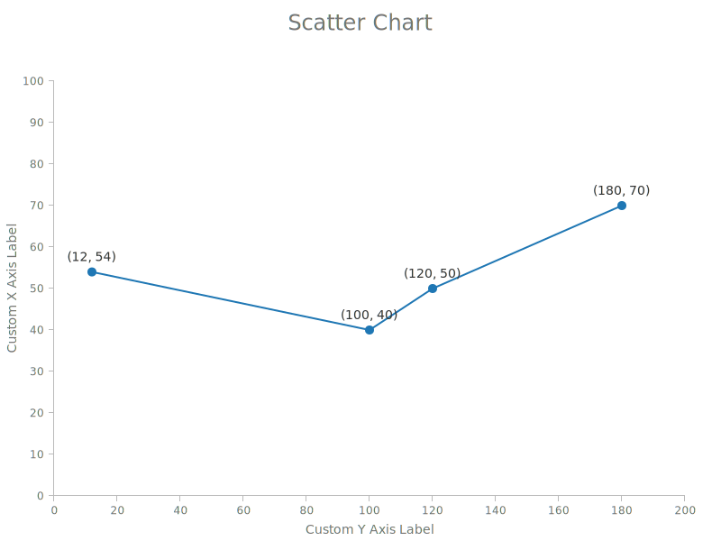

### Area Series

Currently, AreaSeriesView doesn't support datasets with multiple keys, thus
it cannot display a stacked area chart.

```rust
use charts::{Chart, ScaleLinear, MarkerType, PointLabelPosition, AreaSeriesView};

fn main() {
    // Define chart related sizes.
    let width = 800;
    let height = 600;
    let (top, right, bottom, left) = (90, 40, 50, 60);

    // Create a band scale that will interpolate values in [0, 200] to values in the
    // [0, availableWidth] range (the width of the chart without the margins).
    let x = ScaleLinear::new()
        .set_domain(vec![12_f32, 180_f32])
        .set_range(vec![0, width - left - right]);

    // Create a linear scale that will interpolate values in [0, 100] range to corresponding
    // values in [availableHeight, 0] range (the height of the chart without the margins).
    // The [availableHeight, 0] range is inverted because SVGs coordinate system's origin is
    // in top left corner, while chart's origin is in bottom left corner, hence we need to invert
    // the range on Y axis for the chart to display as though its origin is at bottom left.
    let y = ScaleLinear::new()
        .set_domain(vec![0_f32, 100_f32])
        .set_range(vec![height - top - bottom, 0]);

    // You can use your own iterable as data as long as its items implement the `PointDatum` trait.
    let area_data = vec![(12, 54), (100, 40), (120, 50), (180, 70)];

    // Create Area series view that is going to represent the data.
    let area_view = AreaSeriesView::new()
        .set_x_scale(&x)
        .set_y_scale(&y)
        .set_marker_type(MarkerType::Circle)
        .set_label_position(PointLabelPosition::N)
        .load_data(&area_data).unwrap();

    // Generate and save the chart.
    Chart::new()
        .set_width(width)
        .set_height(height)
        .set_margins(top, right, bottom, left)
        .add_title(String::from("Area Chart"))
        .add_view(&area_view)
        .add_axis_bottom(&x)
        .add_axis_left(&y)
        .add_left_axis_label("Custom Y Axis Label")
        .add_bottom_axis_label("Custom X Axis Label")
        .save("area-chart.svg").unwrap();
}
```

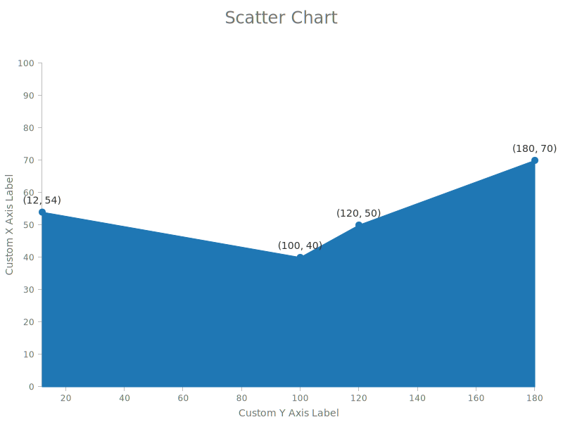

## Chart Composition

Once you understand the basic building blocks (mainly *Scales* and *Views*), the sky is the limit 
(and available implemented views, for now (: ) on what you can achieve using `charts`.

The main idea is to use common scale instances that serve as a common context between different 
datasets and views.

One example is combining a bar chart and a scatter plot:

```rust
use charts::{Chart, VerticalBarView, ScaleBand, ScaleLinear, ScatterView, MarkerType, Color, PointLabelPosition};

fn main() {
    // Define chart related sizes.
    let width = 800;
    let height = 600;
    let (top, right, bottom, left) = (90, 40, 50, 60);

    // Create a band scale that maps ["A", "B", "C"] categories to values in the [0, availableWidth]
    // range (the width of the chart without the margins).
    let x = ScaleBand::new()
        .set_domain(vec![String::from("A"), String::from("B"), String::from("C")])
        .set_range(vec![0, width - left - right]);

    // Create a linear scale that will interpolate values in [0, 100] range to corresponding
    // values in [availableHeight, 0] range (the height of the chart without the margins).
    // The [availableHeight, 0] range is inverted because SVGs coordinate system's origin is
    // in top left corner, while chart's origin is in bottom left corner, hence we need to invert
    // the range on Y axis for the chart to display as though its origin is at bottom left.
    let y = ScaleLinear::new()
        .set_domain(vec![0, 100])
        .set_range(vec![height - top - bottom, 0]);

    // You can use your own iterable as data as long as its items implement the `BarDatum` trait.
    let bar_data = vec![("A", 70), ("B", 10), ("C", 30)];

    // You can use your own iterable as data as long as its items implement the `PointDatum` trait.
    let scatter_data = vec![(String::from("A"), 90.3), (String::from("B"), 20.1), (String::from("C"), 10.8)];

    // Create VerticalBar view that is going to represent the data as vertical bars.
    let bar_view = VerticalBarView::new()
        .set_x_scale(&x)
        .set_y_scale(&y)
        .load_data(&bar_data).unwrap();

    // Create Scatter view that is going to represent the data as points.
    let scatter_view = ScatterView::new()
        .set_x_scale(&x)
        .set_y_scale(&y)
        .set_label_position(PointLabelPosition::NE)
        .set_marker_type(MarkerType::Circle)
        .set_colors(Color::from_vec_of_hex_strings(vec!["#FF4700"]))
        .load_data(&scatter_data).unwrap();

    // Generate and save the chart.
    Chart::new()
        .set_width(width)
        .set_height(height)
        .set_margins(top, right, bottom, left)
        .add_title(String::from("Composite Bar + Scatter Chart"))
        .add_view(&bar_view)                            // <-- add bar view
        .add_view(&scatter_view)                        // <-- add scatter view
        .add_axis_bottom(&x)
        .add_axis_left(&y)
        .add_left_axis_label("Units of Measurement")
        .add_bottom_axis_label("Categories")
        .save("composite-bar-and-scatter-chart.svg").unwrap();
}
```

The result looks as follows:

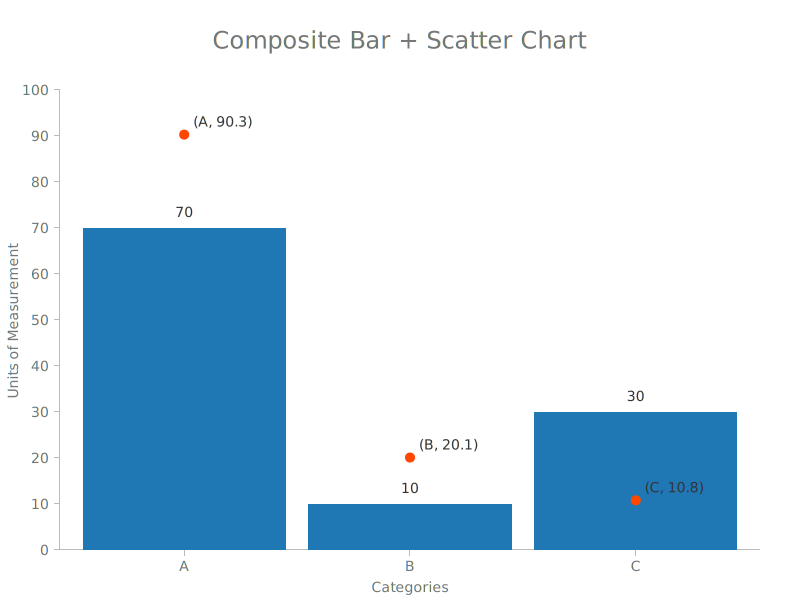

Another example is combining different datasets. For instance, we can define scales that cover
the domain from both datasets and see how they relate to each other.

```rust
use charts::{Chart, ScaleLinear, ScatterView, MarkerType, PointLabelPosition, Color, AxisPosition};

fn main() {
    // Define chart related sizes.
    let width = 800;
    let height = 600;
    let (top, right, bottom, left) = (90, 40, 80, 60);

    // Create a band scale that will interpolate values in [0, 200] to values in the
    // [0, availableWidth] range (the width of the chart without the margins).
    let x = ScaleLinear::new()
        .set_domain(vec![0_f32, 200_f32])
        .set_range(vec![0, width - left - right]);

    // Create a linear scale that will interpolate values in [0, 100] range to corresponding
    // values in [availableHeight, 0] range (the height of the chart without the margins).
    // The [availableHeight, 0] range is inverted because SVGs coordinate system's origin is
    // in top left corner, while chart's origin is in bottom left corner, hence we need to invert
    // the range on Y axis for the chart to display as though its origin is at bottom left.
    let y = ScaleLinear::new()
        .set_domain(vec![0_f32, 100_f32])
        .set_range(vec![height - top - bottom, 0]);

    // You can use your own iterable as data as long as its items implement the `PointDatum` trait.
    let scatter_data_1 = vec![(20, 90), (12, 54), (25, 70), (33, 40)];
    let scatter_data_2 = vec![(120, 10), (143, 34), (170, 14), (190, 13)];

    // Create Scatter view that is going to represent the data as points.
    let scatter_view_1 = ScatterView::new()
        .set_x_scale(&x)
        .set_y_scale(&y)
        .set_marker_type(MarkerType::Circle)
        .set_label_position(PointLabelPosition::N)
        .set_custom_data_label("Apples".to_owned())
        .load_data(&scatter_data_1).unwrap();

    // Create Scatter view that is going to represent the data as points.
    let scatter_view_2 = ScatterView::new()
        .set_x_scale(&x)
        .set_y_scale(&y)
        .set_marker_type(MarkerType::Square)
        .set_label_position(PointLabelPosition::N)
        .set_custom_data_label("Oranges".to_owned())
        .set_colors(Color::from_vec_of_hex_strings(vec!["#aa0000"]))
        .load_data(&scatter_data_2).unwrap();

    // Generate and save the chart.
    Chart::new()
        .set_width(width)
        .set_height(height)
        .set_margins(top, right, bottom, left)
        .add_title(String::from("Scatter Chart"))
        .add_view(&scatter_view_1)
        .add_view(&scatter_view_2)
        .add_axis_bottom(&x)
        .add_axis_left(&y)
        .add_left_axis_label("Custom X Axis Label")
        .add_bottom_axis_label("Custom Y Axis Label")
        .add_legend_at(AxisPosition::Bottom)
        .save("scatter-chart-two-datasets.svg").unwrap();
}
```

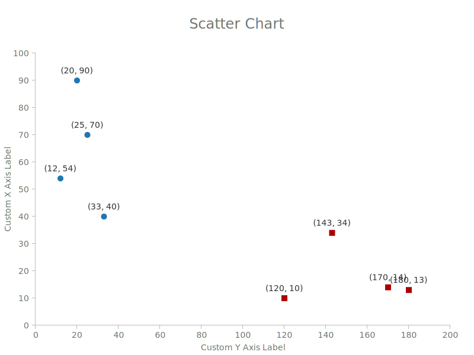

## Next Steps

This is still a work in progress, so the next steps are going to be implementing more views and
improving on existing functionality.